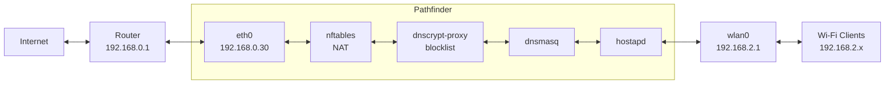

This script turns my Asus mini PC into a basic, secure gateway which I call *Pathfinder*.

This mini PC is an Asus Eee PC X101CH, with intel Atom N2600and 980MB RAM.
I decided to give it a second life as a small networking lab so I could start defining and experimenting with the approach I’d like a real router to take. I dediced to use Alpine looking for an alternative to OpenWrt.
Since the hardware isn’t in perfect condition, it only functions as an access point and not as a router.



## Instalation.
 1. Download the repo.
```
wget https://github.com/miguelpernudo/pathfinder/archive/refs/heads/main.tar.gz
```
or
```
curl -L https://github.com/miguelpernudo/pathfinder/archive/refs/heads/main.tar.gz
```


2. Unzip.
```
tar -xzf main.tar.gz
cd pathfinder-main
```


3. Secrets.
```
cp secrets.env.example secrets.env
vi secrets.env
```
or your text editor.


4. Execute.
```
doas sh install.sh
```
or sudo.

> This script will enable the Alpine community repo automatically,
> as dnscrypt-proxy is not available in the main repo.


## Structure
```
.
├── etc
│   ├── dnscrypt-proxy.toml
│   ├── dnsmasq.conf
│   ├── hostapd.conf
│   ├── logrotate.d
│   │   └── dnscrypt-proxy
│   └── nftables.nft
├── install.sh
├── LICENSE
├── README.md
└── secrets.env.example  ->  for the wpa passphrase
```

## hostapd
The primarily responsible for turning the network card into a network in its own that can be accessed. Set the SSID, password (that's why we need the secrets.env), channel, etc.

## dnsmasq
It's the DHCP server that assigns IP addresses to the devices connected in the network and resolves DNS using dsnCrypt in this case.

## dnsCrypt 
Encrypts the plaintext in DNS queries. Provides an extra layer of security and privacy. 
I would recommend to have a cronjob that automatically installs the blocklist in case it gets updated:

```
doas vi /etc/periodic/weekly/update-blocklist
```
or any name you want.
```
#!/bin/sh
wget -O /etc/dnscrypt-proxy/blocked-names.txt \
  https://raw.githubusercontent.com/hagezi/dns-blocklists/main/domains/pro.txt
rc-service dnscrypt-proxy restart
```
```
doas chmod +x /etc/periodic/weekly/update-blocklist
```

## nftables
A robust firewall with strict policies that allows only necessary traffic. SSH access is permitted only if the user is on the same LAN.

## netdata
For monitoring, http://192.168.1.2:19999 (LAN only).
